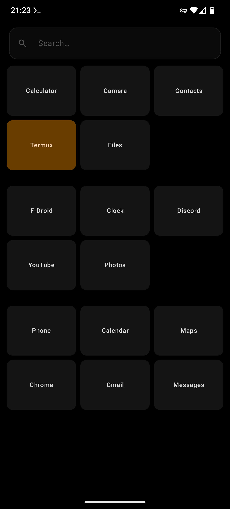

# Quedalle

A minimal, tile-based Android home screen launcher built with Jetpack Compose.

> *Quedalle* — French slang for "absolutely nothing". Because that's how much bloat this launcher has.

## Features

- **App tiles** — grid of installed apps with notification badges
- **Spacer tiles** — colored blank tiles to organize your grid
- **Divider tiles** — thin horizontal lines as visual separators
- **Drag & drop** — long-press any tile to reorder
- **Color picker** — 12 presets + app-color + transparent per tile
- **Search** — filter installed apps inline
- **No internet, no accounts, no tracking**

## Screenshots

| EN | FR |
|---|---|
|  |  |

## Requirements

- Android 8.0 (API 26) or higher
- Optional: notification access (to show badge counts on app tiles)

## Build from source

```bash
git clone https://github.com/MatthieuGrr/quedalle-launcher.git
cd quedalle-launcher
./gradlew assembleRelease
```

Output APK: `app/build/outputs/apk/release/app-release-unsigned.apk`

## Permissions

| Permission | Why |
|---|---|
| `QUERY_ALL_PACKAGES` | Launcher must enumerate all installed apps |
| `BIND_NOTIFICATION_LISTENER_SERVICE` | Optional — show notification badge counts on app tiles |

## Install via F-Droid

*Submission in progress.*

## License

[GPL-3.0-only](LICENSE) — Copyright (C) 2024 Matthieu Georger
