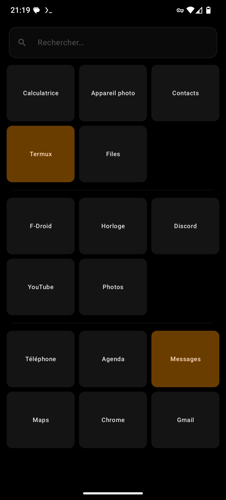

# Quedalle

A minimal, tile-based Android home screen launcher built with Jetpack Compose.

> *Quedalle* — French slang for "absolutely nothing". Because that's how much bloat this launcher has.

## Features

- **App tiles** — a fixed grid of your essential apps, text only
- **Spacer tiles** — colored blank tiles to organize your grid
- **Divider tiles** — thin horizontal lines as visual separators
- **Drag & drop** — long-press any tile to reorder
- **Appearance** — global tile style plus per-tile overrides: background & text colors (presets or custom HSL) and textures (iridescent, gradient, glass), edited live from a single long-press sheet
- **Light & dark theme** — follows the system, or forced in settings
- **Search** — accent-insensitive inline search of installed apps
- **Rename tiles** — give pinned apps your own labels
- **Hide apps** — keep apps out of search results
- **Work profile** — apps from all profiles, with badged labels
- **Swipe down** — open the notification shade (optional)
- **Backup** — export/import your layout as a JSON file
- **No internet, no accounts, no tracking**

The home screen is intentionally finite: it holds exactly what fits the grid
you configured, nothing more. No pages, no app drawer, no widgets.

## Screenshots

| EN | FR |
|---|---|
|  |  |

## Install

[](https://f-droid.org/packages/dev.mlg.quedalle/)

Or grab the APK from the [releases page](https://github.com/MatthieuGrr/quedalle-launcher/releases)
(release APKs are unsigned — F-Droid builds and signs its own).

## Requirements

- Android 8.0 (API 26) or higher

## Permissions

| Permission | Why |
|---|---|
| `REQUEST_DELETE_PACKAGES` | Offer "Uninstall" in the app long-press menu |

No internet permission, no notification access, no analytics.

## Build from source

```bash
git clone https://github.com/MatthieuGrr/quedalle-launcher.git
cd quedalle-launcher
./gradlew assembleRelease
```

Output APK: `app/build/outputs/apk/release/app-release-unsigned.apk`

Run the unit tests with `./gradlew test`.

## License

[GPL-3.0-only](LICENSE) — Copyright (C) 2024 Matthieu Georger
